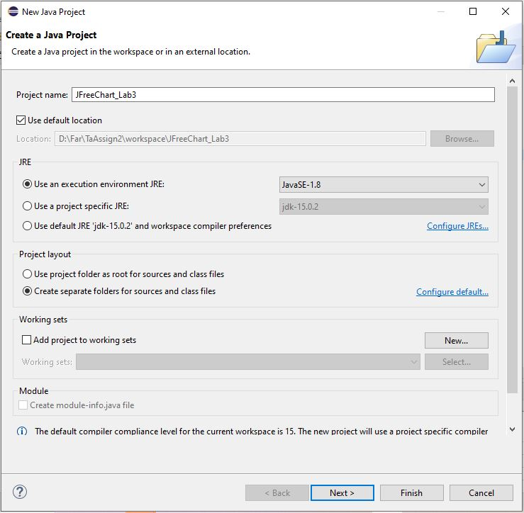
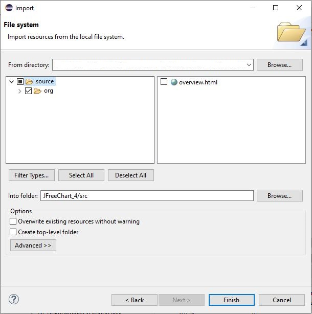
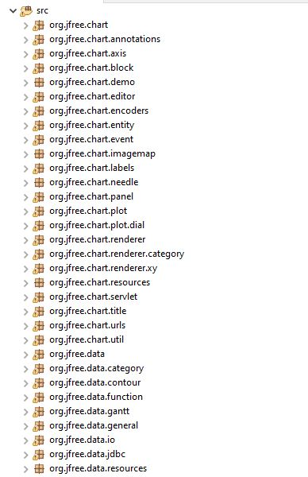
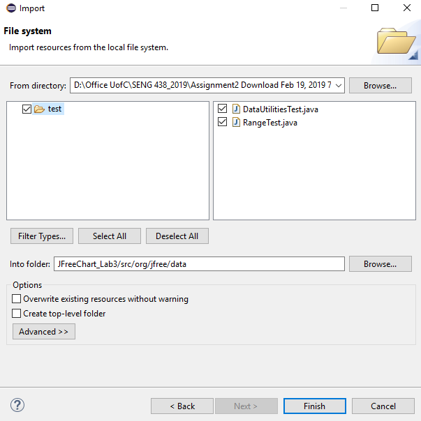
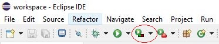

**SENG 438 - Software Testing, Reliability, and Quality**

> **Assignment \#3**

**Code Coverage Measurement & Test Adequacy Assessment**

> Instructor: Dr. Behrouz Far (far@ucalgary.ca) and Dr. Kangsoo Kim (kangsoo.kim@ucalgary.ca)

> Department of Electrical and Computer Engineering

> University of Calgary

Due Date: TBD

> **Summary:** > 
- Download the new version of JFreeChart from [./Assignment3-artifacts.zip](./Assignment3-artifacts.zip). In this assignment you will have access to the source code of JFreeChart. Create a project in Eclipse and add the source into your project. 
- Import the test cases that you have developed in assignment2.
- Calculate the control flow coverage metrics using appropriate tools.
- Explain the pros and cons of the tools you are using and metrics you are reporting.
- Design new test cases (using white-box approach) to increase the coverage for each class under test to meet the minimum coverage criteria described in the document. Classes to be tested are 
    - org.jfree.data.DataUtilities
    - org.jfree.data.Range
- Dataflow coverage needs to be calculated manually.
- Lab report + developed test cases must be submitted as outcome of this assignment.
- All steps must be done as a teamwork.

# 1 INTRODUCTION

This assignment has a similar focus to the previous assignment, as it is once again unit testing. Unit testing will be performed using JUnit [3] in Eclipse [1]. As with the previous assignment, students will start by familiarizing themselves with the usage of the testing tools followed by implementation (enhancement) of the test suite. The major difference between the testing being performed in this assignment and the previous assignment (\#2) is that this assignment shows the students a different technique (white-box coverage criteria) in deciding what test cases to develop.

## 1.1 OBJECTIVES

The objectives of this assignment are to introduce students to the concepts of determining the adequacy of a
white-box test suite based on its coverage of the code. In white-box testing, it is important to measure the
adequacy of a test suite based on completeness defined by the portion of the code which is exercised. This
definition can take several forms, including control-flow coverage criteria: e.g., statement (or node)
coverage, decision (or edge) coverage, condition coverage, path coverage or data-flow coverage criteria: e.g., DU pairs coverage.

After completing the assignment, students will be able:

- To use code coverage tools to measure test adequacy and become aware of similar tools for other programming environments
- To design test cases to improve code coverage
- To understand some of the benefits and drawbacks of measuring test adequacy with code coverage tools
- To gain an understanding of how data-flow coverage works and be able to calculate it by hand

## 1.2 THIS ASSIGNMENT IS A GROUP WORK

All the tasks of this assignment should be completed in group (as you formed in assignment 1). The report should also be completed as a group.

## 1.3 TESTING TOOLS

In addition to JUnit (used and described in Assignment 2), in this assignment you will use one or several Java-based code coverage tool(s).
Some coverage tools are listed below. You are free to choose your tool from that list or outside. Note that not all of tools work with your specific setup and configurations. It is your responsibility to find a tool that does the job for you or use other versions of IDEs

**List of code coverage tools:**

- **EclEmma** [(http://www.eclemma.org/](http://www.eclemma.org/)) --> (recommended tool)

- **CodeCover** [(http://codecover.org/](http://codecover.org/))

- **Clover** ([http://www.atlassian.com/software/clover](http://www.atlassian.com/software/clover))

- **JaCoCo** [(http://www.eclemma.org/jacoco/](http://www.eclemma.org/jacoco/))

- **Coverlipse** [(http://coverlipse.sourceforge.net/](http://coverlipse.sourceforge.net/))

- **Cobertura** [(http://cobertura.github.io/cobertura/](http://cobertura.github.io/cobertura/))

**NOTE:** most coverage tools have issues with mocking plug-ins. If you face problems that could not be solved. Replace your test that uses a mock with a test case that uses the actual dependent on components (only for the sake of simplicity).

## 1.4 SYSTEM UNDER TEST

The system to be tested for this assignment is JFreeChart [2], the same SUT used in Assignment \#2. JFreeChart is an open source Java framework for chart calculation, creation and display. This framework supports many different (graphical) chart types, including pie charts, bar charts, line charts, histograms, and several other chart types. To get started with the JFreeChart system, download the “JFreeChart v2.0.zip” file and extract the entire archive to a known location. More information on how to get started with these files will be provided in the familiarization stage. Note that the versions of JFreeChart distributed for this assignment do not correspond with actual releases of JFreeChart, rather versions modified for the purposes of this assignment.

## 1.4.1 Purpose of the System

The JFreeChart framework is intended to be integrated into other systems as a quick and simple way to add charting functionality to other Java applications. With this in mind, the API for JFreeChart is required to be relatively simple to understand, as it is intended to be used by developers as an open source off-the-shelf framework

### 1.4.2 Usage of the System

While the JFreeChart system is not technically a stand-alone application, the developers of JFreeChart have created several demo classes which can be executed to show some of the capabilities of the system. These demo classes have Demo appended to the class name. For the purpose of this assignment, full knowledge of the usage of the JFreeChart API is not particularly necessary. The framework is grouped into two main packages, (1) org.jfree.chart and (2) org.jfree.data. Each of these two packages is also divided into several other smaller packages. For the purpose of testing in this assignment, we will be focusing on the org.jfree.data package

# 2 FAMILIARIZATION

ALL students should ensure that they understand the concepts in this section before moving on to the rest of the assignment.

1.  If you haven’t done so already, download the JFreeChart v2.0.zip file from Github repository [./Assignment3-artifacts.zip](./Assignment3-artifacts.zip).
2.  Extract the contents of the .zip file into a known location.

## 2.1 CREATE AN ECLIPSE PROJECT

1.  Open Eclipse.
2.  Open the _New Project_ dialog by selecting the _File -\> New -\> Project_…
3.  Ensure that _Java Project_ is selected and click _Next_.
4.  The dialog should now be prompting for the project name. Enter _JFreeChart_Lab3_ in the _Project Name_ field and click _Finish_
5.  Right click on the src folder of your project and click _import_
6.  In the _Import_ dialog, select the _File System_ option (in the _General_ category) and click _Next_.
7.  In the new panel on the _Import_ dialog, click on the _Browse…_ button, then navigate to the JFreeChart 1.0.19 directory and select _source_ folder.
8.  Expand the source folder in the left panel and select _org_, then click on _Finish_ button. You should see the same panel as Figure 2.

**NOTE:** You might need to follow the steps in assignment 2 for _Adding External Libraries_ so then you have the _External Libraries_ as well.

**Figure 1 - New Java Project dialog with name and source path filled in**

**Figure 2 - Import Source**

6.  The project (SUT) is now set up and ready for testing.

**Figure 3 - Part of packages and archives that should be included in the newly-created project**

## 2.2 IMPORT A TEST SUITE

For the purpose of demonstrating the abilities of coverage tools, the test suite developed in Assignment 2 will be used.

1.  Copy and paste your test codes into test folder of your new project or
    follow the following steps to import them.

    - Right click on the org.jfree.data package in the _Package Explorer_. Select _Import…_.

    - In the _Import_ dialog, select the _File System_ option (in the _General_ category) and click _Next_.

    - In the new panel on the _Import_ dialog, click on the _Browse…_ button to choose the directory you import your files from, then navigate to the directory from your previous assignment containing your test files for Range and DataUtilites. Click _OK_.

    - Check your DataUtilities and Range test classes (something similar to what is shown in Figure 3 below). Then click _Finish_.

**Figure 3 - Import dialog with Assignment 2 test classes selected**

The test classes selected are now included in the org.jfree.data package in the new project. **_BUT: please make sure this is the case and that the package name in your test class is defined as org.jfree.data._**

**Note**:

- You should import jmock 2.x library as you did in Assignment 2
- If you want to use junit 4.x, you should import junit 4.x libraries as you did in Assignment 2
- You can find both libraries in [./Assignment3-artifacts.zip](./Assignment3-artifacts.zip).
- To run EclEmma code coverage on Eclipse, select coverage button> Coverage As> JUnit Test. Figure 4

**Figure 4 - Run EclEmma code coverage tool**

# 3 INSTRUCTIONS

## 3.1 MEASURE CONTROL FLOW COVERAGE

**_This design component_** requires that you and your team measure the adequacy of your test suite using one or more code coverage tools and report about the pros and cons of your metrics and tool choices

Measurement of code coverage is performed in two main steps. First, classes must be selected for instrumentation. Classes selected for instrumentation are the classes which will have the coverage measured. Then, the test suite must be run with a coverage tool. You can use any coverage analysis tool. You need to report **three** **coverage** **metrics** (the suggested metrics to report are: statement, branch, and condition coverages).

- **NOTE1:** If the coverage tool that you are using does not support any of the above metrics, first try another tool. If none reports the above measures, then replace the missing measure with another metric that the tool supports, e.g. you might decide to replace condition coverage with method coverage, if you are using EclEmma

- **NOTE2:** Document all coverage tools you tried and what worked or did not work for your configuration. Explain what you fixed (e.g., removing mock objects, updating IDEs, switching to another tool, etc.)

- **NOTE3:** You need to report the pros and cons of tools you tried and the metrics you chose.

> Read Section 3.3. for more details.

## 3.2 MEASURE DATA FLOW COVERAGE MANUALLY

To become more familiar with data flow coverage and achieve a deeper understanding of how coverage tools work, calculate the DU-pair coverage for two methods, by hand. The methods to analyze are: DataUtilities.calculateColumnTotal and one method of your choice from the org.jfree.data.Range class (that you have a test set for, from Assignment 2). Calculate the DU-pair coverage by tracing through the execution of each of your test cases for these methods, manually. This will need to be included in your report. You need to report the followings per method:

- the data flow graph

- the def-use sets per statement

- list all DU-pairs per variable

- for each test case show which pairs are covered

- calculate the DU-Pair coverage.

## 3.3 TEST SUITE DEVELOPMENT

In this section, you will be required to **design new unit tests** for two classes to increase their code coverage. The classes to be tested are: org.jfree.data.DataUtilities and org.jfree.data.Range. Note that although the focus in adequacy criteria has changed (it is now on source code), to develop new test cases the test oracle should still be derived from the requirements (as contained in the Javadocs of the SUT)

As with any testing to be done, to begin with, a plan must be created. Document this test plan, as it will be included with your lab report. This plan should include information about who will create which tests, how you plan to develop tests to achieve the adequacy criteria. For thiassignment, a test suite should be developed which has at least thfollowing coverage for each of the classes under test

Minimum coverage:

- 90% statement coverage

- 70% branch coverage

- 60% condition coverage

**Note**: If your initial test cases (the ones designed in assignment 2) already meet the above requirements, it is recommended that you still design new test cases and try to increase the coverage of your test cases.

Carry out your test plan, creating tests for all methods. As a good test designer, you have to keep each test case (for a single control flow path for example) in a separate method, for example: testPositiveValuesForMethodX() and testNegativeValuesForMethodX(), instead of a single testMethodX(). This will help to keep test cases consistent, and make metrics taken later on more meaningful. Note that the classes have random defects in them intentionally, and thus several of your tests should fail. Therefore, to develop test oracles in your test code, you need to follow the specifications, not the actual results by the SUT code.

If you have divided the tests and completed them individually, then upon completion of the tests, review each other’s’ tests, looking for any inconsistencies or defects in the tests themselves. Include all the updates made during the peer review process in your lab report

Measure the code coverage (only control flow metrics as listed above) of your entire test suite, and record detailed coverage information for each class and method. Include this information (preferably in a tabular form) in your lab report

# 4 SUMMARY

Students should now have a good understanding of measuring test suite adequacy based on coverage of the SUT’s code. This should include an understanding of some of the different control flow and data flow coverage criteria, and the relative difficulty to satisfy these coverage criteria.
Students should now have an idea of some of the trade-offs that occur when choosing different test suite adequacy criteria for testing.

# 5 Evaluation Criteria

## 5.1 Demo (20%)

The objectives for the demo are a) Preparing you for technical presentations, b) an early assessment of your work to give you a second chance to submit a high-quality report, and c) making sure everybody in the team contributes evenly.

It is mandatory for all team members to attend the demo session and explain the TAs in the lab what they have done for this assignment individually. For this particular assignment, Lab6 is the demo day. You are expected to almost finish the assignment by the lab hour. All the team members should attend the lab. The TAs will go through the groups and each group must demonstrate the control flow coverages of the assignment 2 test suite. Then each student should show one test that improves at least one measure, by running the test and showing the new coverage. The students may be asked about the exact place that the missing coverage happened and also about the coverage tool(s) used

**NOTE1: Student who miss the demo session or are unable to demo what is detailed above are considered as less-contributors and may lose up to the entire assignment 3’s mark.**

**NOTE2: You still have time to further improve your test suite, after the demo session and before the deadline.**

**NOTE3: In the demo session, the TAs might ask each student questions related to any part of the assignment for the purpose of students’ assessment.**

## 5.2 JUNIT TEST SUITE (40%)

The test suite will be required to be submitted along with the lab report. Students will be graded on their unit tests. The grading criteria are as follows.

| Marking Scheme                                                                                                                                                                                             |     |
| ---------------------------------------------------------------------------------------------------------------------------------------------------------------------------------------------------------- | --- |
| **Code coverage**: lesser coverage than coverage target specified in lab instructions above, would decrement your mark proportionally, unless you explain it by a valid the reason (e.g., infeasible path) | 15% |
| **Clarity** (are they easy to follow, through commenting or style, etc.?)                                                                                                                                  | 10% |
| **Correctness** (do the tests actually test what they are intended to test?)                                                                                                                               | 15% |

## 5.3 LAB REPORT (40%)

Students will be required to submit a report on their work in the assignment as a group. To be consistent, please use the template markdown file ([Assignment3-ReportTemplate.md](Assignment3-ReportTemplate.md)) provided online under the Assignment 3 folder. If desired, feel free to rename the sections, as long as the headings are still descriptive and accurate. In the report should be included.

| Marking Scheme                                                                                                                                                                           |     |
| ---------------------------------------------------------------------------------------------------------------------------------------------------------------------------------------- | --- |
| Manual data-flow coverage calculations the two mentioned methods                                                                                                                         | 10% |
| A detailed description of the testing strategy for the new unit tests                                                                                                                    | 5%  |
| A high level description of five selected test cases you have designed using coverage information, and how they have increased code coverage                                             | 5%  |
| A detailed report of the coverage achieved of each class and method (a screen shot from the code cover results in green and red color would suffice)                                     | 5%  |
| Pros and cons of the coverage tools tried by your group in this assignment, in terms of reported measures, integration with the IDE and other plug-ins, user friendliness, crashes, etc. | 5%  |
| A comparison on the advantages and disadvantages of requirements-based test generation and coverage-based test generation.                                                               | 5%  |
| A discussion on how the team work/effort was divided and managed                                                                                                                         | 2%  |
| Any difficulties encountered, challenges overcome, and lessons learned from performing the assignment                                                                                    | 2%  |
| Comments/feedback on the assignment itself                                                                                                                                               | 1%  |

A portion of the grade for the lab report will be allocated to organization and clarity.

# 6 ACKNOWLEDGEMENTS

This lab is part of a software-testing laboratory courseware available under a Creative Commons license.

# 7 REFERENCES

1.  "Eclipse.org," Internet: [http://www.eclipse.org](http://www.eclipse.org/)

2.  "JFreeChart," Internet: <http://www.jfree.org/jfreechart>

3.  "JUnit," Internet: [http://www.junit.org](http://www.junit.org/)
